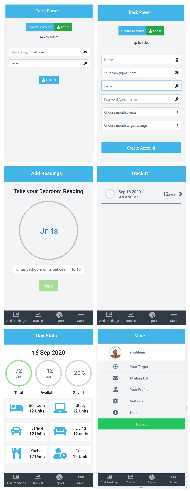

[![Contributors][contributors-shield]][contributors-url]
[![Forks][forks-shield]][forks-url]
[![Stargazers][stars-shield]][stars-url]
[![Issues][issues-shield]][issues-url]


<!-- PROJECT LOGO -->
<br />
<p align="center">
  <a href="https://github.com/shubham14p3/track-power">
    
  </a>

  <h3 align="center">Rails Api + React&Redux --> [Power Tracker]</h3>

  <p align="center">
    This project is part of the Microverse curriculum in React module!
    <br />
    <a href="https://github.com/shubham14p3/track-power"><strong>Explore the docs »</strong></a>
    <br />
    <br />
    <a href="https://github.com/shubham14p3/track-power/issues">Report Bug</a>
    ·
    <a href="https://github.com/shubham14p3/track-power/issues">Request Feature</a>
  </p>
</p>

<!-- TABLE OF CONTENTS -->
## Table of Contents

* [About the Project](#about-the-project)
  * [Built With](#built-with)
  * [Usage](#usage)
  * [Automated Test](#automated-test)
* [Contributors](#contributors)
* [Acknowledgements](#acknowledgements)
* [License](#license)

<!-- ABOUT THE PROJECT -->
## About The Project
Final capstone based on a tracking app.
The project was built as a mobile web app first, meaning that the tablet and desktop design could present some inconsistencies.
The requirements can be found [here](https://www.notion.so/track-power-Project-Tracking-App-22e454da738c46efaf17721826841772) :point_left:

The main functionality of the app is to track domestic power consumption. It can register measurements across rooms in the house.
The main rooms are bedroom, study, garage, living, kitchen, and guests.
Each measurement taken to these rooms will be then registered in a separate page with additional timestamp. The measurement will be accessible and will represent useful information on total power consuming, the available units left and what has been saved in percentages.

The main tasks the app can do for now are:
- The user is required to register with name, email, password, monthly units available (i.e. 1800, 2100, 2400, 2700, 3000). Selected units will be divided by numbers of days in a month to derive daily quota, and also and the target saving for power consumption (i.e. 5%, 10%, 15%, 20%, 25%) which will be calculated against total month consumption to see if target is met.
- The user can log in by typing the mail and password
- The user will be able to manually register for each room how much power is planning to consume
- The user can then access the page with measurements and check the progress of it within time.
- Each measurement has a dedicated page with daily measurements of each room.

###



### Built With
This project was built using these technologies.
* Rails
* ReactJs
* Redux
* Postgresql
* Heroku Buildpack
* ES6
* Node.js
* ESLint
* StyleLint
* GithubActions :muscle:
* Atom :atom:

<!-- INSTALLATION -->
## Usage

To have this app on your pc, you need to:
* [download](https://github.com/shubham14p3/track-power/archive/develop.zip) or clone this repo:
  - Clone with SSH:
  ```
    git@github.com:shubham14p3/track-power.git
  ```
  - Clone with HTTPS
  ```
    https://github.com/shubham14p3/track-power.git
  ```

* In the project directory, you can run:

  - `$ npm install && bundle install` - installs all the dependencies required by the project
  - `$ rake db:create && rails db:migrate` to create and migrate the tables and build the database.

  - `$ rails server` - will run the local server.
    - Open [http://localhost:3000](http://localhost:3000) to view it in the browser.
    - For each changes in the project the page must be reloaded to view changes.
    - You will also see any lint errors in the console.

## Automated Test
  Open the terminal in the project's root directory and run:
  ```
  $ bundle exec rspec
  ```
  - the following output will be generated
  


## Live Demo & Deployment
The project has been deployed with [Heroku](https://www.heroku.com/)

[Heroku Live Demo Link](https://ghastly-chupacabra-45064.herokuapp.com/) :point_left:

<!-- CONTACT -->
## Contributors

👤 **Shubham Raj**

- LinkedIn: [Shubham Raj](https://www.linkedin.com/in/shubham14p3/)
- GitHub: [@shubham14p3](https://github.com/shubham14p3)
- E-mail: shubham14p3@gmail.com

## :handshake: Contributing

Contributions, issues and feature requests are welcome!

Feel free to check the [issues page](https://github.com/shubham14p3/track-power/issues).

## Show your support

Give a :star: if you like this project!

<!-- ACKNOWLEDGEMENTS -->
## Acknowledgements
* [Microverse](https://www.microverse.org/)
* [Rails Api Documentation](https://api.rubyonrails.org/)
* [React Documentation](https://reactjs.org/docs/getting-started.html)
* [Heroku Documentation](https://devcenter.heroku.com/)

<!-- MARKDOWN LINKS & IMAGES -->
<!-- https://www.markdownguide.org/basic-syntax/#reference-style-links -->
[contributors-shield]: https://img.shields.io/github/contributors/shubham14p3/track-power.svg?style=flat-square
[contributors-url]: https://github.com/shubham14p3/track-power/graphs/contributors
[forks-shield]: https://img.shields.io/github/forks/shubham14p3/track-power.svg?style=flat-square
[forks-url]: https://github.com/shubham14p3/track-power/network/members
[stars-shield]: https://img.shields.io/github/stars/shubham14p3/track-power.svg?style=flat-square
[stars-url]: https://github.com/shubham14p3/track-power/stargazers
[issues-shield]: https://img.shields.io/github/issues/shubham14p3/track-power.svg?style=flat-square
[issues-url]: https://github.com/shubham14p3/track-power/issues

## 📝 License

This project is [MIT](https://opensource.org/licenses/MIT) licensed.
